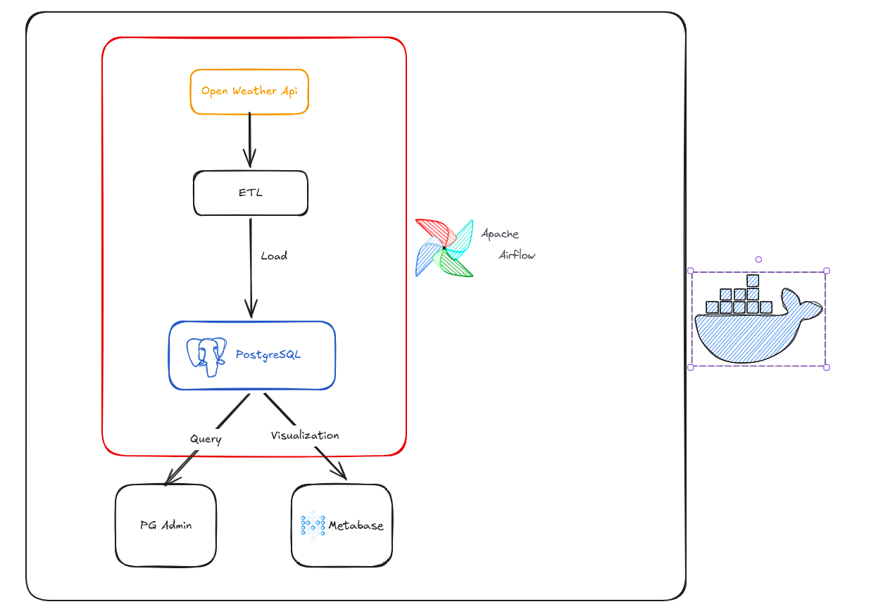

# Weather Data ETL Pipeline

Orchestrating real-time weather insights from OpenWeather API to Interactive Dashboards.

## Project Overview

This project builds a simple data pipeline that ingests weather data from the OpenWeather API, processes the data, and stores it in a PostgreSQL database. The workflow is orchestrated using Apache Airflow and containerized with Docker to ensure a consistent development environment.

The stored data can be queried using pgAdmin and visualized through Metabase dashboards.

## Architecture



Pipeline flow:

OpenWeather API → ETL Process → PostgreSQL → Data Query (pgAdmin) / Data Visualization (Metabase)

Apache Airflow is responsible for scheduling and orchestrating the ETL workflow.

## Tech Stack

-  **Python** – Main language for ETL logic
-  **Apache Airflow** – Workflow orchestration
-  **Docker** – Containerization
-  **PostgreSQL** – Data Warehouse
-  **Metabase** – Data Visualization


## Data Pipeline

The ETL pipeline consists of three main stages:

### Extract
Weather data is retrieved from the OpenWeather API using the Python `requests` library.

### Transform
The raw API response is processed and structured into a clean format suitable for database storage.

### Load
The processed data is loaded into a PostgreSQL table using SQLAlchemy and Pandas.

## Database Schema

**Table:** `weather_logs`

| Column | Description |
|------|------|
| city_name | Name of the city |
| temperature | Temperature (°C) |
| pressure | Atmospheric pressure |
| humidity | Humidity percentage |
| weather_description | Weather condition description |
| wind_speed | Wind speed |
| clouds | Cloud coverage |
| date_fetched | Timestamp when the data was collected |

## Setup Instructions

### 1. Clone the repository

```bash
git clone https://github.com/hdminh279/weather_pipeline_ETL.git
cd weather_pipeline_ETL
uv sync
```
### 2. Install dependencies

This project uses uv for dependency management.
```bash
uv sync
```

### 3. Configure environment variables

Create and configure the .env file with your API key and database credentials.

### 4. Start the services

```bash
docker compose up -d
```

### 5. Access the services
| Service  | URL                                            |
| -------- | ---------------------------------------------- |
| Airflow  | [http://localhost:8081](http://localhost:8081) |
| pgAdmin  | [http://localhost:8084](http://localhost:8084) |
| Metabase | [http://localhost:3000](http://localhost:3000) |
